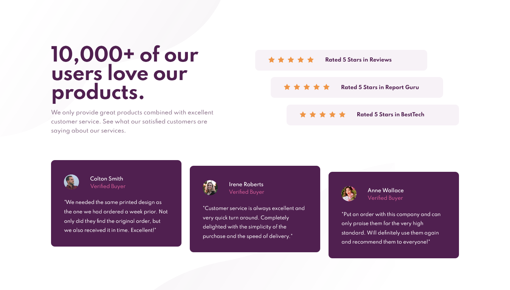

# Frontend Mentor - Social proof section solution

This is a solution to the [Social proof section challenge on Frontend Mentor](https://www.frontendmentor.io/challenges/social-proof-section-6e0qTv_bA). Frontend Mentor challenges help you improve your coding skills by building realistic projects!

## Table of contents

- [Overview](#overview)
  - [The challenge](#the-challenge)
  - [Screenshot](#screenshot)
  - [Links](#links)
- [My process](#my-process)
  - [Built with](#built-with)
  - [What I learned](#what-i-learned)
  - [Continued development](#continued-development)
  - [Useful resources](#useful-resources)
- [Author](#author)

## Overview

### The challenge

Users should be able to:

- View the optimal layout for the section depending on their device's screen size

### Screenshot

Desktop view:



### Links

- Solution URL: [Click here](https://www.frontendmentor.io/solutions/mobile-first-html-scss-flexbox-bem-dYlQQgOWV)
- Live Site URL: [See live site here](https://juanbonilla.me/FEM_social-proof-section/)

## My process

### Built with

- Semantic HTML5 markup
- CSS / SCSS custom properties
- Flexbox
- Mobile-first workflow
- BEM Methodology

### What I learned

When I reach the part of dealing with these boxes that had a different position, I started thinking on how can I solve this challenge. So, I first thought on ```position: relative;``` or ```position: absolute;``` as a solution, but I fell it could be tricky moving these boxes with top, left, right or bottom properties. Then I remembered I have used ```display: flex;``` on my parent div, in this case I rather chose adding class modifiers to every element that had to move. Luckly, in this challenge both parent divs contain three divs and their positions could be changed using ```align-self```. 

See below my solution:

HTML:
```html
<div class="reviews">
  <div class="card card--start">...</div>
  <div class="card card--center">...</div>
  <div class="card card--end">...</div>
</div>
```
SCSS:
```scss
.reviews {
  height: 260px;
  width: 80%;
  max-width: 1200px;
}

.card {
  &--start {
    align-self: flex-start;
  }

  &--center {
    align-self: center;
  }

  &--end {
    align-self: flex-end;
  }
}
```

### Continued development

This is another challenge I continue working with the mobile-first workflow, I feel I am improving on this. I will continue using Flexbox to solve some challenges when positioning boxes. 

### Useful resources

- [BEM explained with an example](https://www.youtube.com/watch?v=bvnzyXGkNY4&t=1555s) - This well explained video showed me how to get a better understanding of BEM and how to use it in my projects.

## Author

- Website - [juanbonilla.me](https://juanbonilla.me/)
- Frontend Mentor - [@juanpb96](https://www.frontendmentor.io/profile/juanpb96)
- LinkedIn - [Juan Bonilla](https://www.linkedin.com/in/juan-pablo-bonilla-6b8730115/)
